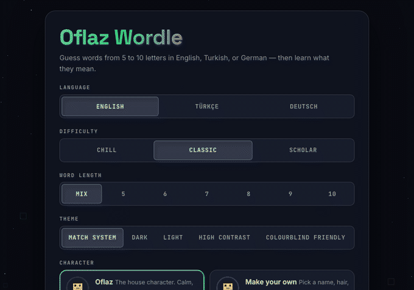

# Oflaz Wordle

A Wordle clone I built that plays in English, Turkish and German. Words run from
5 to 10 letters, and after each game you can look up what the word actually
meant, which was the whole reason I started it.

It runs on your own machine. No account, nothing leaves your laptop.

<p align="center">
  
</p>

## Try it

**macOS or Linux**

```bash
curl -fsSL https://raw.githubusercontent.com/Coflazo/wordle/main/install.sh | bash
```

**Windows** (PowerShell)

```powershell
irm https://raw.githubusercontent.com/Coflazo/wordle/main/install.ps1 | iex
```

That grabs the repo, installs Python and a C++ compiler if you don't have them,
builds everything and opens the game. Takes a couple of minutes the first time.

After that:

```bash
python run.py
```

It opens at `http://localhost:8000`. Ctrl+C to stop.

## Playing

Guess the word. Green means right letter, right place. Yellow means the letter
is in there somewhere else. Grey means it isn't in the word.

Type on your keyboard or tap the one on screen. Repeated letters work properly,
so if the answer is SPEED and you guess ERASE, only one E gets credit.

A few things beyond plain Wordle:

- Pick a length from 5 to 10, or leave it on Mix
- Chill gives you everyday words and an extra guess, Scholar gives you rarer ones
- There's a daily puzzle, same word for everyone, and you can copy the result grid
- The hint button tells you how many words still fit and which guess narrows it most
- Words you solve build up a vocabulary page with your stats

## What's under it

Python and FastAPI for the server, plain HTML and CSS and JS for the front end,
and a C++ core for the parts Python was slow or wrong at.

The C++ bit ended up mattering more than I expected. Turkish broke everything:
`'İSTANBUL'.lower()` gives you nine characters for an eight letter word, and
`'KIZIL'.lower()` gives you `kizil`, which isn't a word, so valid guesses kept
getting rejected. Doing the lowercasing properly meant writing it once in C++ and
using it for both the game and the word list builder.

The rest of the C++ is the word banks (about 590,000 words, memory mapped so
startup is instant) and the hint solver, which scores every candidate against
every possible guess. For Turkish that's 29 million combinations per turn, which
is why it's threaded and not in Python.

Your games and stats live in `oflaz_wordle.db` next to the code. Delete it to
start over.

## Requirements

Python 3.11 or newer, and a C++ compiler. The installer sets both up if they're
missing. You need a connection the first time to pull the word lists, after that
it works offline.

## Poking at it

```bash
python run.py --reload        # restart on file changes
python -m pytest tests -q     # 151 tests
```

Word lists come from [dwyl/english-words](https://github.com/dwyl/english-words),
[google-10000-english](https://github.com/first20hours/google-10000-english),
[Turkce-Kelime-Listesi](https://github.com/CanNuhlar/Turkce-Kelime-Listesi) and
[german-wordlist](https://github.com/enz/german-wordlist). Meanings come from
Wiktionary, [TDK](https://sozluk.gov.tr) and
[OpenThesaurus](https://www.openthesaurus.de).

Answers are filtered, so no slurs, no proper nouns, no verb infinitives, and
nothing that's only in the list because a subtitle file used it once. Rude words
that are real words still count as guesses, they just never come up as answers.

MIT licensed. The word lists keep their own licences.
